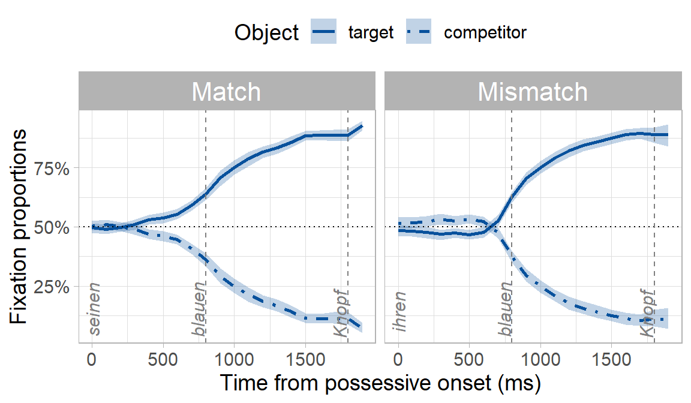
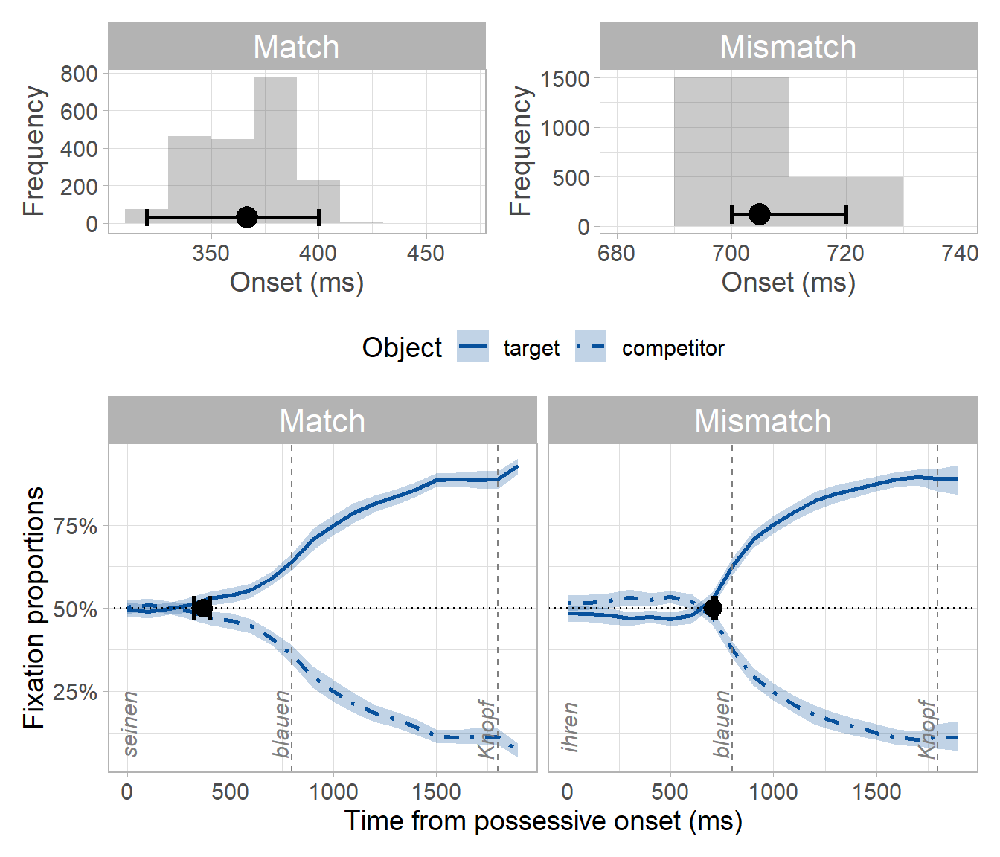
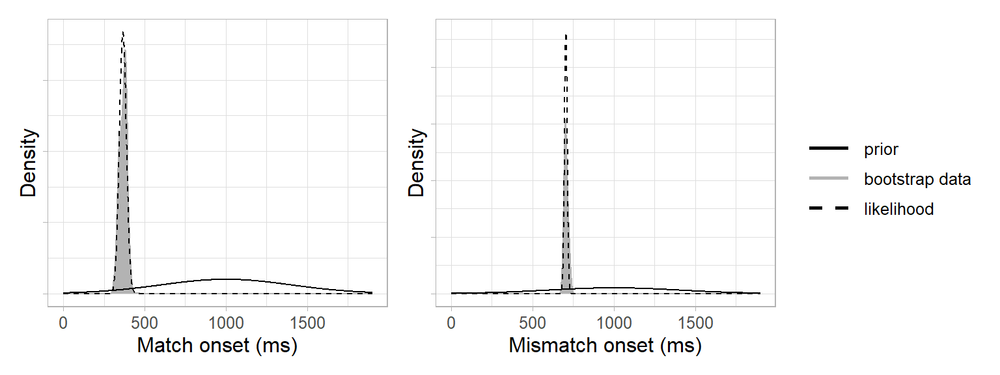
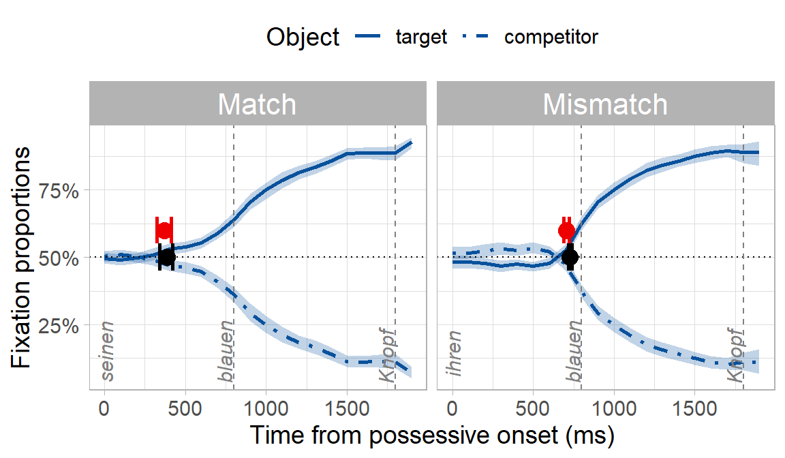

The visual world is a useful paradigm in psycholinguistics for tracking people's eye fixations as they listen to sentences containing some kind of experimental manipulation. A common question is whether the experimental manipulation makes people look at a target object earlier in one condition than another. To answer this, we need to decide *when* in each condition people start looking at the target and compare these timepoints between conditions. But this is not as straightforward as it sounds!^[There are several existing methods for answering temporal questions about visual world data, including [cluster permutation](https://doi.org/10.1037/a0031813), [BDOTS](https://doi.org/10.1016/j.jml.2018.05.004), and GAMMs. We summarise these in [Stone et al., 2020](https://doi.org/10.1017/S1366728920000607) and outline why they weren't able to answer our specific question about whether one onset was significantly faster than another.] We came up with a bootstrapping method to do this in [Stone, Lago & Schad, 2020](https://doi.org/10.1017/S1366728920000607). However, bootstrapping makes some unlikely assumptions about data---I'll come to these later---and so here we try to improve on these assumptions by adding Bayesian principles to our method. This was an approach developed with [João Veríssimo](https://www.jverissimo.net/), [Daniel Schad](https://danielschad.github.io/), and [Sol Lago](https://sollago.github.io/), and we apply it in [this paper](https://osf.io/3uz7x/).


### The bootstrap procedure

A full workthrough of our bootstrap procedure can be found in [Stone et al., 2020](https://doi.org/10.1017/S1366728920000607), but for a quick overview here, we use example data from an experiment on using syntactic gender to predict an upcoming noun in German. Participants heard sentences like “*Klicke auf seinen blauen…*” (click on his.~MASC~ blue.~MASC~ ...), while looking at two blue objects on a screen. Only one of the objects matched the gender marking of the pronoun and adjective. There were two experimental conditions: in the `match` condition, the target object and the object's owner matched in gender, e.g. *seinen Knopf* (his button.~MASC~). In the `mismatch` condition, the target object and the object's owner mismatched in gender, e.g. *ihren Knopf* (her button.~MASC~). 

<center>
{width=85% height=85%}
</center>

Because of the gender cue on the possessive and adjective (e.g. -en suffix), we expected participants to predict the target object and look preferentially at it before they heard its name. What we really wanted to know though was whether predictive looks would be delayed in the mismatch condition where there was a conflicting gender cue, even though the conflicting cue was syntactically irrelevant (i.e. the object's owner being masculine or feminine has no bearing on what the upcoming object might be). You can already see below that the onset of when participants looked preferentially at the target appears to be later in the mismatch condition: 





But is this "prediction onset" in the mismatch condition *significantly* later than the match condition? We can find out using our bootstrapping procedure, which has the following steps:

1. Conduct a statistical test of fixations between the target and competitor at each timepoint in each condition (similar to a permutation test, e.g. [Groppe, Urbach & Kutas, 2011](https://doi.org/10.1111/j.1469-8986.2011.01273.x); [Maris & Oostenveldt, 2007](https://doi.org/10.1016/j.jneumeth.2007.03.024); [Barr, Jackson & Phillips, 2014](https://doi.org/10.1037/a0031813)),
2. Decide on an alpha (usually 0.05) and find the first significant test statistic in a run of five consecutive significant test statistics ([Sheridan & Reingold, 2012](https://doi.org/10.1080/13506285.2012.693548); [Reingold & Sheridan, 2014](https://doi.org/10.3389/fpsyg.2014.01432) take a similar approach).^[Depending on your experimental manipulation (e.g. how big or sustained you expect your experimental effect to be) and how you've set up your data (e.g. binned, unbinned, eye tracker sampling rate), your criterion for the number of consecutive significant tests may differ.] This was our divergence point for each condition, which we consider the onset of evidence for predictions,
3. Resample the data 2000 times with replacement and repeat steps 1-2 after each resample.

\noindent The procedure thus has 3 distinct components: 

i) a set of statistical tests comparing fixations to the target vs. competitor, 
ii) a criterion for deciding where the onset is, and 
iii) a way to generate a distribution of these onsets (resampling). 

The unique contribution of our procedure versus existing methods was iii): we estimate the sampling distribution of an onset in each condition, which we can then use to statistically compare onsets between conditions. 

The procedure yields two bootstrap distributions: one distribution each of onsets for the match and mismatch conditions. We take the mean and the 95th percentile confidence interval (CI) of the match/mismatch distributions as an estimate of the prediction onset for each condition and its temporal variability:




By subtracting the match from the mismatch distribution, we obtain a distribution of differences between conditions. We take the mean and the 95th percentile CI of this difference distribution as the estimated difference in prediction onset. We can decide whether the difference is different from zero by looking at whether the 95th percentile CI of the difference distribution contains zero. Since it does not, we can conclude that the difference between conditions is not zero. Moreover, since all values in the distribution are positive, we can conclude that predictions were slower in the mismatch condition:


***

#### Limitations of the bootstrap procedure


\noindent As mentioned earlier, the bootstrap makes some unlikely assumptions ([Bååth, 2018](http://www.sumsar.net/blog/2015/04/the-non-parametric-bootstrap-as-a-bayesian-model/)):

- Any values not seen in the observed data are impossible
- Each value in the observed data has an equal probability of occurring every time the experiment is run
- We have no prior knowledge about what datapoints might be observed

These assumptions limit our interpretation of the results. Another limitation of our procedure above is that while it allows us to conclude that there is a significant difference between match and mismatch prediction onsets, it does not allow us to quantify *how much* evidence we have for this conclusion. 

***

### Adding Bayesian principles 


[Bayesian inference](https://en.wikipedia.org/wiki/Bayesian_inference) estimates our certainty about an event based on our prior knowledge about the probability of that event and new data. In our case, the event is prediction onsets. We can estimate our certainty about prediction onsets via Bayes' theorem, which estimates a [posterior probability distribution](https://en.wikipedia.org/wiki/Posterior_probability) using two components: priors to encode our expectations about when the onset could be, and data to inform posterior inference via a [likelihood function](https://en.wikipedia.org/wiki/Likelihood_function)^[Other possibilities for adding Bayesian principles to our procedure could have been to use the Bayesian Bootstrap ([Rubin, 1981](https://doi.org/10.1214/aos/1176345338)), implemented in R in `bayesboot` [(Bååth, 2018)](http://www.sumsar.net/blog/2016/02/bayesboot-an-r-package/). Unfortunately, `bayesboot` didn't suit our particular bootstrapping method, partly because it doesn't take a multi-step function like ours (see steps 1-3 above), but also because it doesn't take more informative priors---at least not currently. Alternatively, we could have fit e.g. GLMMs in `brms` [(Bürkner, 2018)](https://github.com/paul-buerkner/brms) to test between fixation proportions at each timepoint (step 1). But this would only apply Bayesian inference to estimating the *magnitude* of the difference in fixations between target and competitor at each timepoint, when what we really want is to apply it to finding the temporal variability of the onset.]. 

We start with the priors: we reasoned that predictiton onsets could only arise in the 1600 ms time window between the onset of the pronoun and the onset of the noun (adding 200 ms for saccade planning). We therefore specified a normal distribution centered in the middle of this critical window, with a 95% probability of the onset falling between 200 and 1800 ms: $N(1000,400)$. Our prior distributions for the match and mismatch conditions therefore looked like this:


Next, we needed a likelihood function. This involved two steps: We used the bootstrap data to approximate a likelihood and a normal distribution to approximate a likelihood function (i.e. Laplace approximation). This was based on the assumption of the central limit theorem that the population distribution underlying the bootstrap data was approximately normal^[Using a normal distribution for the likelihood assumes that, with sufficient observations and bootstrap samples, the bootstrap distribution will approach a normal distribution in line with the central limit theorem. However, this is not always the case. An alternative way to define the likelihood would be to use a kernel density estimator instead: we present this approach in the appendices of [this paper](https://osf.io/3uz7x/).]. In other words, our likelihood function was a normal distribution with the mean and standard deviation of the bootstrap data: 




Finally, we could now derive the posterior distribution as the product of the prior and the likelihood. Because the prior and the likelihood are normal distributions, the posteriors for each condition can be derived analytically as the [product of two Gaussian probability density functions](https://ccrma.stanford.edu/~jos/sasp/Product_Two_Gaussian_PDFs.html), where

- $N(\mu_{prior},\sigma_{prior})$ is the prior,
- $N(\mu_{lik},\sigma_{lik})$ is the likelihood,
- $\mu_{posterior}$ is the mean of the posterior, and
- $\sigma_{posterior}$ is the standard deviation of $\mu_{posterior}$

The posterior distribution of the onset in the match condition is therefore:

$$ \begin{aligned}
\mu_{posterior} &= \frac{\mu_{prior} \sigma_{lik}^2 + \mu_{lik} \sigma_{prior}^2}{\sigma_{lik}^2 + \sigma_{prior}^2} \\
&= \frac{1000 \cdot 22^2 + 367 \cdot 400^2}{22^2 + 400^2} \\ &= 369 ms
\end{aligned}
$$

$$ \begin{aligned}
\sigma_{posterior} &= \sqrt\frac{\sigma_{prior}^2 \sigma_{lik}^2}{\sigma_{prior}^2 + \sigma_{lik}^2} \\ &= 
\sqrt\frac{400^2 \cdot 22^2}{400^2 + 22^2} \\ &= 22 ms 
\end{aligned}
$$

Via the same calculation, the posterior for the mismatch onset is 705 ms (SD = 9 ms). We can add these posteriors to our plots and see that they resemble the bootstrap data:


This is because our prior was relatively uninformative, and so the posteriors are informed more strongly by the bootstrap data than by the prior. If we had defined a strongly informative prior to say we were very certain that the prediction onsets would be 1000 ms, e.g. $N(1000, 10)$, then the posteriors would be pulled toward the prior (not completely, as they're still being informed by the data):


How do the Bayesian onsets (red, uninformative priors) compare with the onsets from the original bootstrap procedure (black)? Quite well:




Now, how to decide whether the mismatch condition was slower? Because the match and mismatch posteriors are normal distributions, we can find the posterior of their difference as the [difference of two normal distributions](https://mathworld.wolfram.com/NormalDifferenceDistribution.html):

$$ \begin{aligned}
\mu_{posterior_{difference}} &= \mu_{posterior_{mismatch}} - \mu_{posterior_{match}} \\
 &= 705 - 369 \\
 &= 336 ms
\end{aligned}
$$

$$ \begin{aligned}
\sigma_{posterior_{difference}} &= \sqrt(\sigma^2_{posterior_{mismatch}} + \sigma^2_{posterior_{match}}) \\
 &= \sqrt(9^2 + 22^2) \\
 &= 24ms
\end{aligned}
$$

We now have a posterior estimate that predictions in the mismatch condition were 336 ms slower than in the match condition, with a 95\% credible interval of 288--384 ms. This posterior aligns quite well with the original bootstrap difference distribution, which estimated a difference of 338 ms with a 95th percentile interval of 300--380ms.


#### Quantifying evidence with a Bayes factor

\noindent How much has seeing the data changed our belief in the null hypothesis that the difference between match/mismatch conditions is zero? Since the likelihood is not normalised, we can use the Savage-Dickey method to compute a Bayes factor and quantify evidence against the null ([Dickey & Lientz, 1970](https://www.jstor.org/stable/2239734); [Wagenmakers et al., 2010](https://doi.org/10.1016/j.cogpsych.2009.12.001)). This method finds the ratio of prior to posterior density at some point value (e.g. zero): 


We compute the ratio via the equation below, where

- $\theta$ is the point at which we want to compare densities (e.g. zero), 
- $H_0$ is our prior distribution, 
- $H_1$ is our posterior distribution, and 
- $D$ is the data:

$$ BF_{01} = \frac{p(D|H_1)}{p(D|H_0)}= \frac{p(\theta = 0|H_1)}{p(\theta = 0|D,H_1)} $$

Or in R form:


```r
# define the null hypothesis
null_hypothesis <- 0

# find the density of the prior at the null hypothesis
density_prior_null     <- dnorm(null_hypothesis, 
                                difference_prior_mean, 
                                difference_prior_sd)

# find the density of the posterior at the null hypothesis
density_posterior_null <- dnorm(null_hypothesis, 
                                difference_posterior_mean, 
                                difference_posterior_sd)


# use Savage-Dickey equation to compute the Bayes factor
(BF01 <- density_posterior_null/density_prior_null)
```

```
## [1] 1.402512e-44
```

The Bayes factor can be interpreted as a ratio of evidence for one hypothesis over the other. Because our posterior density at zero is less than the prior density (in fact, the posterior density at zero is almost zero), the Bayes factor is less than 1 and thus favours the alternative hypothesis that there is a match/mismatch difference. We can see more clearly how overwhelminlgy it favours the alternative hypothesis if we flip the ratio to test the alternative vs. null hypotheses (BF10) rather than the null vs. alternative (BF01):


```r
(BF10 <- 1/BF01)
```

```
## [1] 7.130063e+43
```


### Conclusions

\noindent Using our Bayesian divergence point analysis, we find strong evidence that prediction onsets were slower when there were two conflicting gender cues. The posterior estimate of the "mismatch effect" size was 336 ms, with a 95\% credible interval of 288--384 ms. But our existing bootstrap procedure already led us to the same conclusion, so what was the advantage of adding Bayesian principles? 

The Bayesian approach has all the advantages that Bayesian inference has over frequentist null hypothesis significance testing. These include that the posterior is a continuous probability distribution that gives us information about the probability of non-observed values in the data. The 95\% credible interval can thus be interpreted as a range of possible between-condition differences in which the true size of the difference should lie with 95\% probability, given the data and the analysis. This interpretation is more intuitive than the percentile confidence interval from the existing bootstrap method, which just told us were 95\% of the resampled data lay. Moreover, we can now quantify evidence for our conclusions, and even for the null hypothesis. Finally, because the Bayesian method uses priors, we can use our posterior estimates as information about plausible effect sizes to inform the priors of future experiments.


<!-- ### Appendix 1 {-} -->

<!-- \noindent Above we mentioned that the distribution of our bootstrap data is not normal, and so using a normal distribution as a likelihood may not be appropriate. Instead, we can use a density function as our likelihood, although this means it is no longer possible to obtain the posterior as the product of two Gaussians. Also, our likelihood is still not normalised. To solve these issues, here we demonstrate how to use a density likelihood and obtain the posterior via sampling.  -->

<!-- First we define a likelihood for the match condition using a kernel density estimator of the original bootstrap data: -->

<!-- ```{r, echo=TRUE} -->
<!-- # define a range of onsets for which we would like to find onset probabilities, -->
<!-- # roughly corresponding to our window of interest: -->
<!-- values <- seq(0, 1900, 1) -->

<!-- # kernel density estimator: -->
<!-- density_likelihood_match  <- data.frame(dens = density(bootstrap_samples$match,  -->
<!--                                                     from = min(values), -->
<!--                                                     to = max(values), -->
<!--                                                     n = length(values))$y) -->

<!-- ``` -->

<!-- Then we need a density distribution for the prior using the prior mean and SD we used above: -->

<!-- ```{r, echo=TRUE} -->
<!-- density_prior_match <- data.frame(dens = dnorm(values,  -->
<!--                                                mean = prior_mean,  -->
<!--                                                sd = prior_sd)) -->

<!-- ``` -->


<!-- Then we multiply the likelihood and prior density distributions to get the posterior density distribution: -->

<!-- ```{r, echo=TRUE} -->
<!-- density_posterior_match <- data.frame(post = density_likelihood_match$dens *  -->
<!--                                         density_prior_match$dens) -->

<!-- ``` -->

<!-- And finally we sample from the posterior to obtain a *probability* distribution of onsets: -->

<!-- ```{r, echo=TRUE} -->
<!-- samples_posterior_match <- data.frame(post = sample(values, size=100000, -->
<!--                                     replace = TRUE, -->
<!--                                     prob = density_posterior_match$post)) -->
<!-- ``` -->


<!-- The parameters of our sampled posterior are: -->

<!-- ```{r, echo=TRUE} -->
<!-- # mean -->
<!-- round(mean(samples_posterior_match$post)) -->

<!-- # 95% CrI -->
<!-- quantile(samples_posterior_match$post, probs = c(.025, .975)) -->
<!-- ``` -->


<!-- We repeat for the  mismatch condition and get: -->

<!-- ```{r} -->
<!-- # define a likelihood using kernel density estimator -->
<!-- density_likelihood_mismatch   <- data.frame(dens = density(bootstrap_samples$mismatch,  -->
<!--                                                          from = min(values), -->
<!--                                                          to = max(values), -->
<!--                                                          n = length(values))$y) -->

<!-- # sample from the posterior using the density likelihood -->
<!-- ## create a density distribution of the prior -->
<!-- density_prior_mismatch        <- data.frame(dens = dnorm(values,  -->
<!--                                                          mean = prior_mean,  -->
<!--                                                          sd = prior_sd)) -->

<!-- ## then multiply the likelihood and prior PDFs -->
<!-- density_posterior_mismatch    <- data.frame(post = density_likelihood_mismatch$dens *  -->
<!--                                               density_prior_mismatch$dens) -->

<!-- ## then sample from the posterior -->
<!-- samples_posterior_mismatch    <- data.frame(post = sample(values, size = 100000, -->
<!--                                                     replace = TRUE, -->
<!--                                                     prob = density_posterior_mismatch$post)) -->

<!-- ``` -->

<!-- ```{r, echo=TRUE} -->
<!-- # mean -->
<!-- round(mean(samples_posterior_mismatch$post)) -->

<!-- # 95% CrI -->
<!-- quantile(samples_posterior_mismatch$post, probs = c(.025, 0.975)) -->

<!-- ``` -->


<!-- If we overlay these on our fixation curves, we can see that the sampling onset posteriors (purple) yield similar estimates to the normal distribution onset posteriors (red). This suggests that the normal distribution approach actually did a pretty good job approximating the posteriors, even though the bootstrap data didn't look very normal: -->


<!-- ```{r, fig.height=5, fig.width=10} -->
<!-- # match -->
<!-- posterior_mean_ma_norm <- mean(samples_posterior_match$post) -->
<!-- posterior_ci.lower_ma_norm <- quantile(samples_posterior_match$post, probs = c(.025))[[1]] -->
<!-- posterior_ci.upper_ma_norm <- quantile(samples_posterior_match$post, probs = c(.975))[[1]] -->

<!-- # mismatch -->
<!-- posterior_mean_mi_norm <- mean(samples_posterior_mismatch$post) -->
<!-- posterior_ci.lower_mi_norm <- quantile(samples_posterior_mismatch$post, probs = c(.025))[[1]] -->
<!-- posterior_ci.upper_mi_norm <- quantile(samples_posterior_mismatch$post, probs = c(.975))[[1]] -->

<!-- ### Plot -->

<!-- ggplot(plot_exp2, aes(Time, MeanFixation)) + -->
<!--   stat_summary(fun.data = mean_cl_boot,  -->
<!--                aes(fill = Region), geom = "ribbon", alpha = .25, show.legend = FALSE) + -->
<!--   stat_summary(fun = mean, geom = "path",  -->
<!--                aes(group = Region, colour = Region, linetype = Region), size = 1) + -->
<!--   facet_grid(.~ Condition, labeller = as_labeller(facet_names)) + -->

<!--   # add vertical lines for time windows -->
<!--   geom_hline(yintercept = .5, linetype = "dotted") + -->
<!--   geom_vline(xintercept = onsets, linetype = "dashed", colour = "grey50") + -->

<!--   # add word stimuli -->
<!--   geom_text(data = subset(words, Condition == "match"), label = "seinen", y = .13,  -->
<!--             x = 0, angle = 90, fontface = "italic", size = 5, colour = "grey50") + -->
<!--   geom_text(data = subset(words, Condition == "mismatch"), label = "ihren", y = .12,  -->
<!--             x = 0, angle = 90, fontface = "italic", size = 5, colour = "grey50") + -->
<!--   annotate(geom = "text", label = "blauen", x = onsets[1]-60, y = .13, angle = 90, -->
<!--            fontface = "italic", size = 5, colour = "grey50") + -->
<!--   annotate(geom = "text", label = "Knopf", x = onsets[2]-60, y = .11, angle = 90, -->
<!--            fontface = "italic", size = 5, colour = "grey50") + -->

<!--   # add bootstrapped onset and credible interval in the MATCH condition -->
<!--   ## normal likelihood method -->
<!--   geom_point(data = filter(plot_exp2, Condition == "match"),  -->
<!--              size = 4, colour = "red2", aes(x = posterior_mean_ma, y = .55)) + -->
<!--   geom_errorbarh(data = filter(plot_exp2, Condition == "match"), -->
<!--                  height = .07, colour = "red2", aes(y    = .55, -->
<!--                   xmin = qnorm(c(.025), posterior_mean_ma, posterior_sd_ma), -->
<!--                   xmax = qnorm(c(.975), posterior_mean_ma, posterior_sd_ma))) + -->

<!--   ## density likelihood method -->
<!--   geom_point(data = filter(plot_exp2, Condition == "match"), -->
<!--              size = 4, colour = "purple", aes(x = posterior_mean_ma_norm, y = .45)) + -->
<!--   geom_errorbarh(data = filter(plot_exp2, Condition == "match"), -->
<!--                  size = 1, height = .07, colour = "purple", -->
<!--                  aes(y    = .45, -->
<!--                      xmin = posterior_ci.lower_ma_norm, -->
<!--                      xmax = posterior_ci.upper_ma_norm)) + -->

<!--   # add bootstrapped onset and credible interval in the MISMATCH condition -->
<!--   ## normal likelihood method -->
<!--   geom_point(data = filter(plot_exp2, Condition == "mismatch"), -->
<!--              size = 4, colour = "red2", aes(x = posterior_mean_mi, y = .55)) + -->
<!--   geom_errorbarh(data = filter(plot_exp2, Condition == "mismatch"), -->
<!--                  size = 1, height = .07, colour = "red2", aes(y = .55, -->
<!--                     xmin = qnorm(c(.025), posterior_mean_mi, posterior_sd_mi), -->
<!--                     xmax = qnorm(c(.975), posterior_mean_mi, posterior_sd_mi))) + -->

<!--   ## density likelihood method -->
<!--   geom_point(data = filter(plot_exp2, Condition == "mismatch"), -->
<!--              size = 4, colour = "purple", aes(x = posterior_mean_mi_norm, y = .45)) + -->
<!--   geom_errorbarh(data = filter(plot_exp2, Condition == "mismatch"), -->
<!--                  height = .07, colour = "purple", -->
<!--                  aes(y    = .45, -->
<!--                      xmin = posterior_ci.lower_mi_norm, -->
<!--                      xmax = posterior_ci.upper_mi_norm)) + -->

<!--   # axes and legends -->
<!--   labs(x = "Time since possessive onset [ms]", y = "Fixations to objects") + -->
<!--   scale_x_continuous(breaks = seq(0, 2500, 500), labels = seq(0, 2500, 500)) + -->
<!--   scale_y_continuous(labels = scales::percent_format(accuracy = 1)) + -->
<!--   scale_linetype_manual(values = lty, name = "Object:") + -->
<!--   scale_colour_manual(values = col, name = "Object:") + -->
<!--   scale_fill_manual(values = col, name = "Object:") + -->

<!--   # theme settings -->
<!--   theme_light() + -->
<!--   theme(text = element_text(size = 20),  -->
<!--         legend.position = "none", -->
<!--         strip.text = element_text(size = 20)) -->

<!-- ``` -->


<!-- ```{r, eval=FALSE, out.height="85%", out.width="75%", fig.align="center", fig.cap="\\label{fig:sampledlikelihood}Comparison of a posterior obtained as the product of two Gaussians (red) vs. via sampling (blue)."} -->

<!-- # posterior as multiplication of prior and likelihood pdfs, followed by sampling -->
<!-- plot(density(na.omit(bootstrap_samples$dp)), xlim=xlims, col = "grey50",  -->
<!--      xlab = "Match-mismatch onset difference (ms)",  -->
<!--      main = "Comparison of posterior methods", frame.plot = FALSE, yaxt = "n") -->
<!-- axis(side = 2, labels = FALSE) -->
<!-- lines(prior.df$dens ~ values, xlim=xlims, lty = 1, lwd = 2) -->
<!-- lines(likelihood.df$dens ~ values, lty = 2, xlim=xlims, lwd = 2) -->
<!-- abline(v=posterior.mean.sampled) -->
<!-- # lines(dnorm(0:600, posterior.mean.sampled, posterior.sd.sampled), xlim=xlims, col = "red2", lwd = 2, lty=1) -->
<!-- lines(likelihood$dens ~ values, lty = 2, xlim=xlims, lwd = 2, col="red2") -->
<!-- lines(density(posterior.samples$post), xlim=xlims, col = "blue4", lwd = 2, lty=1) -->
<!-- legend("topleft", bty = "n", col = c("grey50","black","black","red2","blue4"),  -->
<!--        legend = c("bootstrap data","prior","likelihood: density","likelihood: normal","posterior: sampled"), -->
<!--        lty = c(1,1,2,2,1), lwd = c(2,2,2,2,2)) -->


<!-- ``` -->
